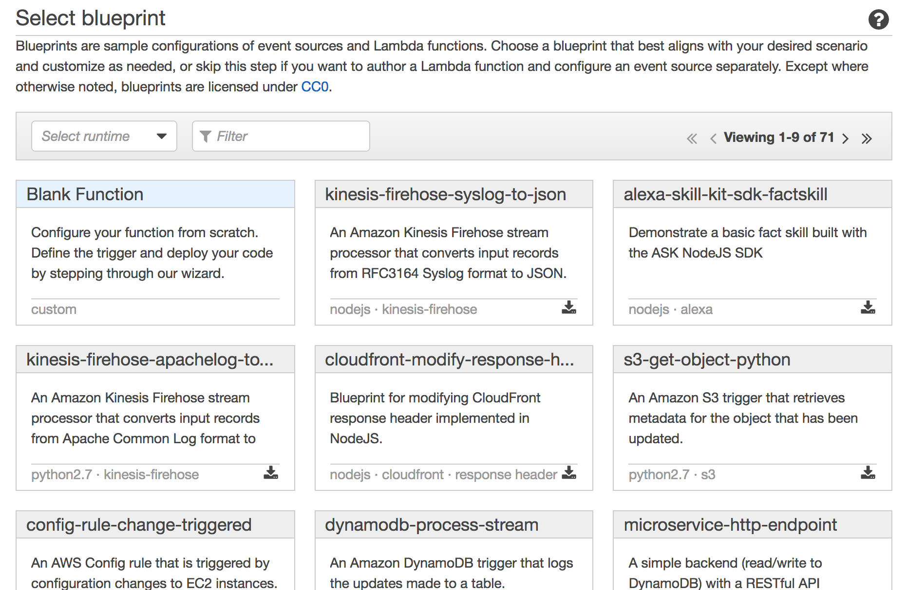
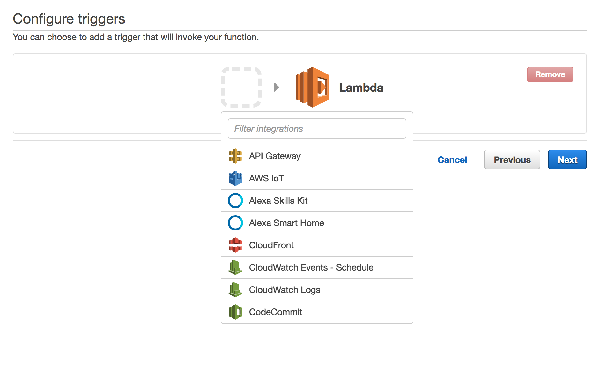
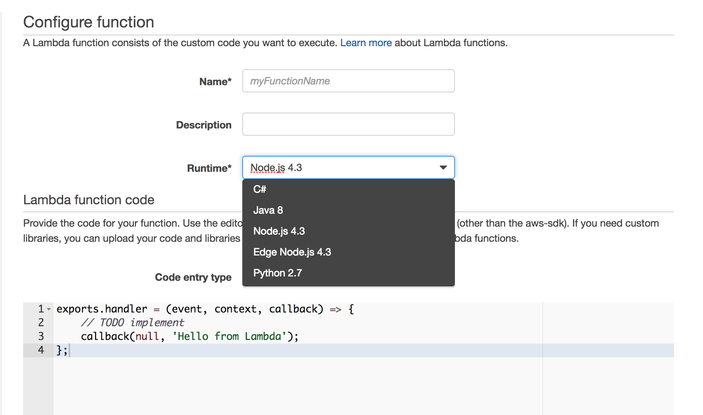
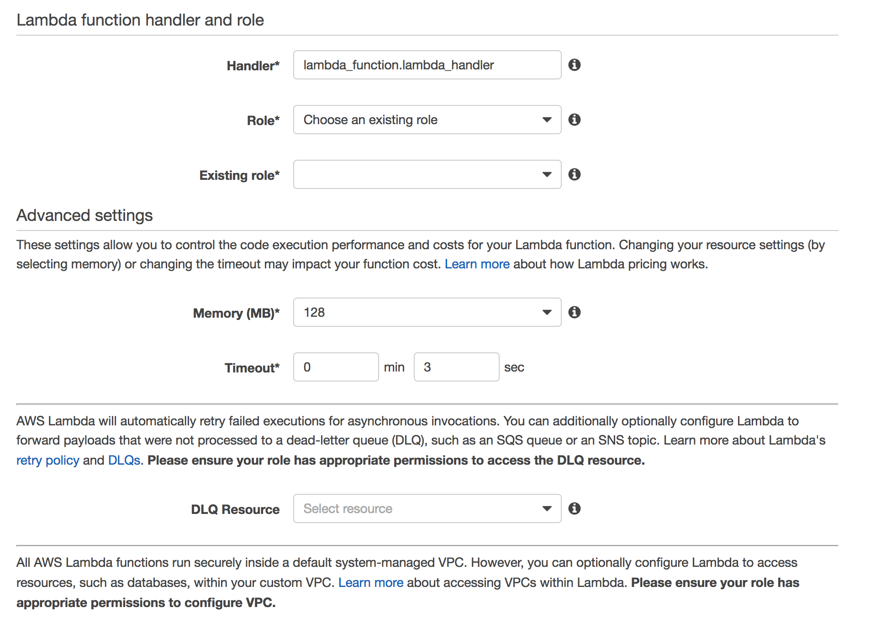
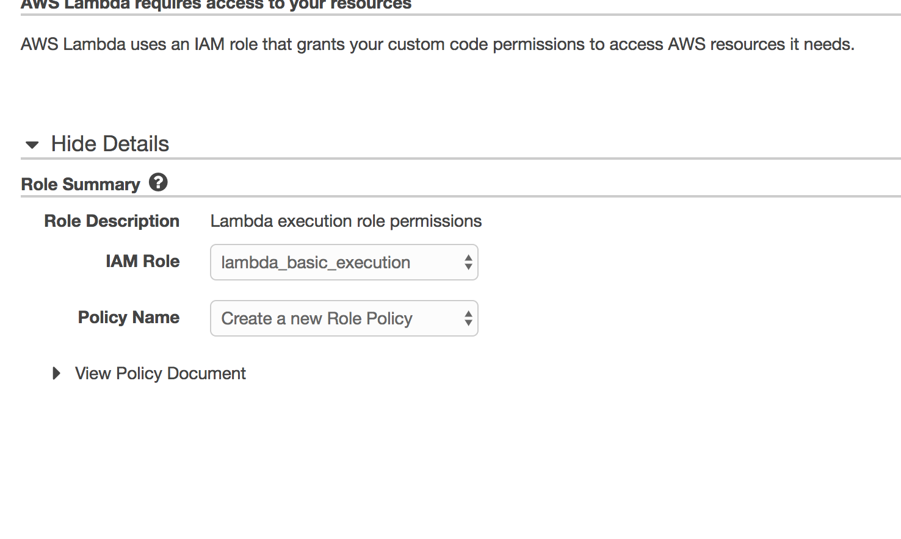
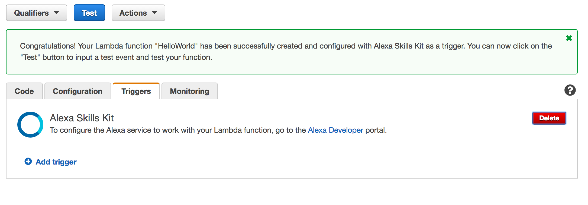

<fs x-large>Create a Lambda Function to Interface with the Alexa Skills Kit</fs>
-----------------------------------------------------------------------------------------------------------------------------

**Author:** Tristan Brodeur 

**Email:** brodeurtristan@gmail.com

**Date:** Last modified on 12/29/16 

**Keywords:** Alexa, Lambda</fs>

-----------------------------------------------------------------------------------------------------------------------------

<fs medium>**Overview**</fs>

AWS Lambda is a service that executes code in response to events, thus saving the developer the trouble of maintaining a server. Lambda also links seamlessly to the Alexa Skills Kit, which makes it an excellent tool for running the code for Alexa Skills.

-----------------------------------------------------------------------------------------------------------------------------

-To use lambda, you must first create an [AWS](https://aws.amazon.com/) (Amazon Web Services) account.

-If you already have an account, sign in. Create an account if you do not, using the free tier account.

-Once signed into the AWS console, verify that the region you are using to run your code is the US East region(N. Virginia).

-Click the Lambda service under the list of services.

-Once you click "Get started now" in the next screen, a list of blueprints will follow. Select "Blank Function" from the list.

-----------------------------------------------------------------------------------------------------------------------------

-----------------------------------------------------------------------------------------------------------------------------

-In the next screen, you must link your lambda function to the Alexa Skills Kit. Click the blank box and choose "Alexa Skills Kit" from the list of drop-downs.

-----------------------------------------------------------------------------------------------------------------------------

-----------------------------------------------------------------------------------------------------------------------------

-The next step is to configure your function. In the name field, enter a descriptive name for the function. This will, however, not be the name that users will invoke to call your function. Next, enter a description for your function. Then select the server language you will choose to run your code.

-----------------------------------------------------------------------------------------------------------------------------

-----------------------------------------------------------------------------------------------------------------------------

-Scroll down and configure the rest of the options before entering in the code.

-----------------------------------------------------------------------------------------------------------------------------

-----------------------------------------------------------------------------------------------------------------------------

-Handler specifies the runtime language function that Lambda should
invoke when it runs your code, in the format: <file
name>.<function name>. 

-<file name> can be replaced with the name of your file if uploaded via zip, or leave it as is if using the inline editor.<function name> can be replaced with the name of your function used to pass the json file to. 

-//If you are following the "Hello World" tutorial, leave the handler as is.//

-Role specifies the IAM security role to use when running the Lambda
function. If you have used Lambda before, you may have a role
called lambda_basic_execution. In that case, you can use the
existing one. If not, select “Create a custom role” in the drop-down to create
a new role. A new window will appear to configure the role. 

-In the new window, in the drop-down labeled "IAM Role", select [lambda_basic_execution].
Leave the other drop-down as is and click allow.

-----------------------------------------------------------------------------------------------------------------------------

-----------------------------------------------------------------------------------------------------------------------------

-When defining a Lambda function, you can either write your code in
an inline editor right in the Amazon Lambda interface or upload it as
a zip file. The inline editor is currently capped at 20KB, so for bigger
functions, or if you need to split your code into multiple files (for
example if you use libraries), the zip file approach is the way to go.

-//If you are following the "Hello World" tutorial, grab the code from [this page](http://www.daslhub.org/unlv/wiki/doku.php?id=echo_hello_world) and paste it in the inline editor//

-Once the code is added, scroll down to the end of the page and click Next to save the
configuration.

-In the wizard’s final step, you’ll see an overview of the Lambda
function setup. Check that everything looks correct, and then click
Create function

-Now that you have created the function and put its code in place, 
check to make sure the trigger is set to Alexa Skills Kit in the Triggers tab.

-----------------------------------------------------------------------------------------------------------------------------

-----------------------------------------------------------------------------------------------------------------------------

-If its not set, click "Add trigger" and choose "Alexa Skills Kit".

-//If you are following the "Hello World" tutorial, you can continue [here](http://www.daslhub.org/unlv/wiki/doku.php?id=echo_hello_world).//